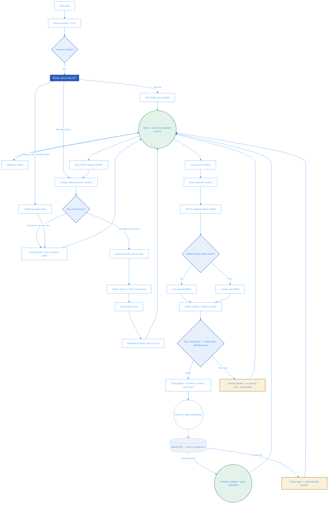
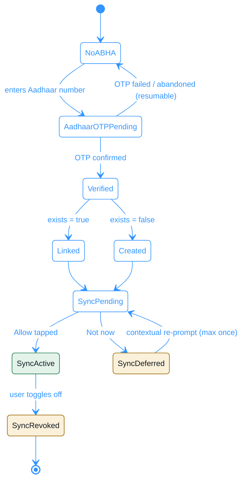
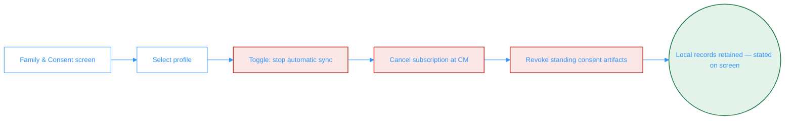

# Flowcharts: Onboarding → ABHA Link → Sync Consent

Companion diagrams for [`spec.md`](./spec.md) (onboarding/router/ABHA linking)
and [`../003-abdm-sync-subscription/spec.md`](../003-abdm-sync-subscription/spec.md)
(sync consent + revoke). A rendered, styled version of these three diagrams
was also published as a standalone visual for review — see PR discussion.

## Diagram 1 — Account to active sync (the full path)

Node color key: **router** (the one branching decision) · **decision**
(system/CM checks) · **async** (background job, dashed) · **deferred**
(skip/not-now, re-prompted at most once) · **terminal** (Home or a completed
outcome).

## Diagram 2 — ABHA & sync state

## Diagram 3 — Revoke

